### 团队简介

大家好，我们是金融负面信息判定赛道的葫芦娃团队，本赛题的队伍成员均来自哈工大深圳的人类自然语言技术(HLT)课题组，成员包括刘宇瀚、李嘉明、殷熔磾、刘道兴以及袁朝发。指导老师为徐睿峰教授。


### 方案分享


我们将从以下六点进行介绍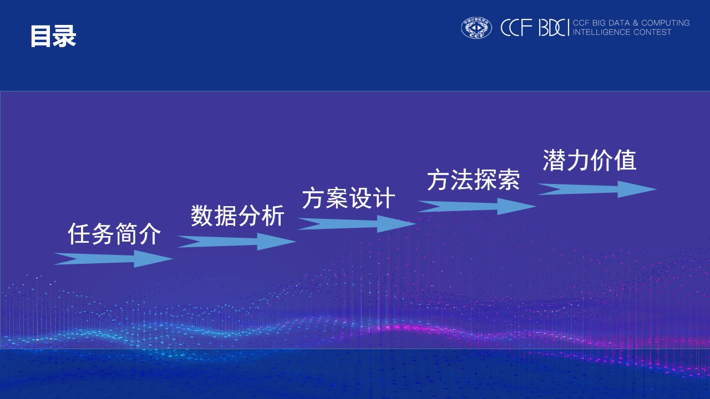

首先是任务简介与数据格式，具体的数据下载详见 [BDCI2019金融负面信息判定](https://www.datafountain.cn/competitions/353/datasets)，也可以参考```data```文件夹里面的数据


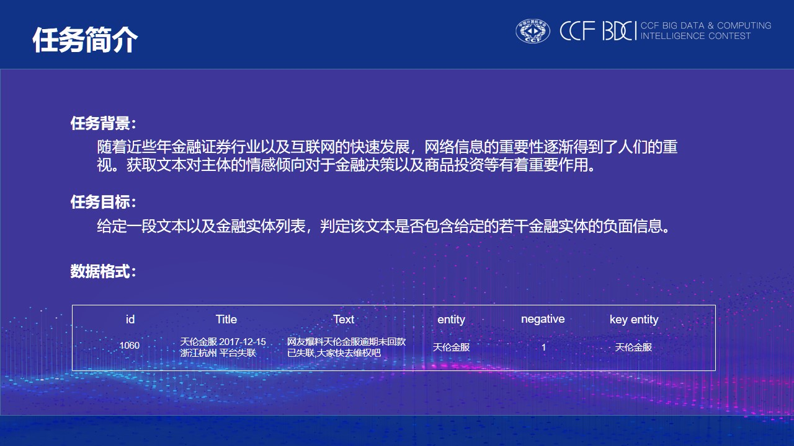


整个数据存在一下的特征：

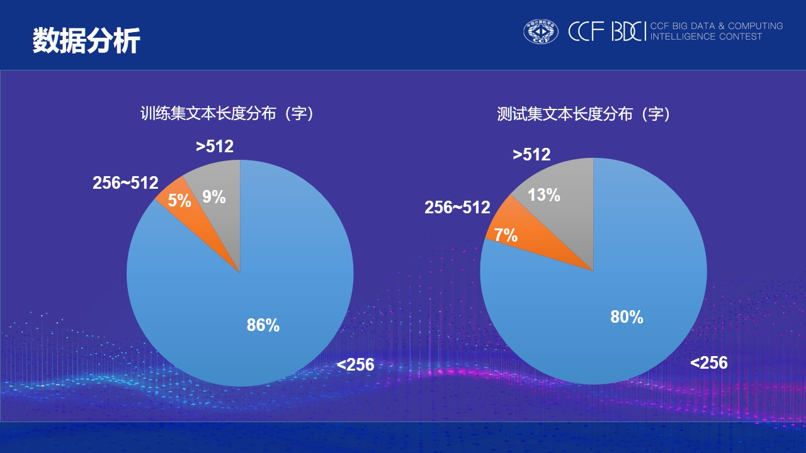


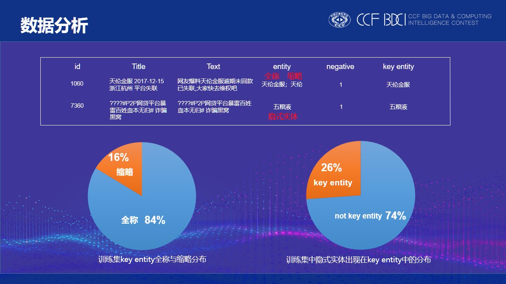


我们的整体方案流程如下：

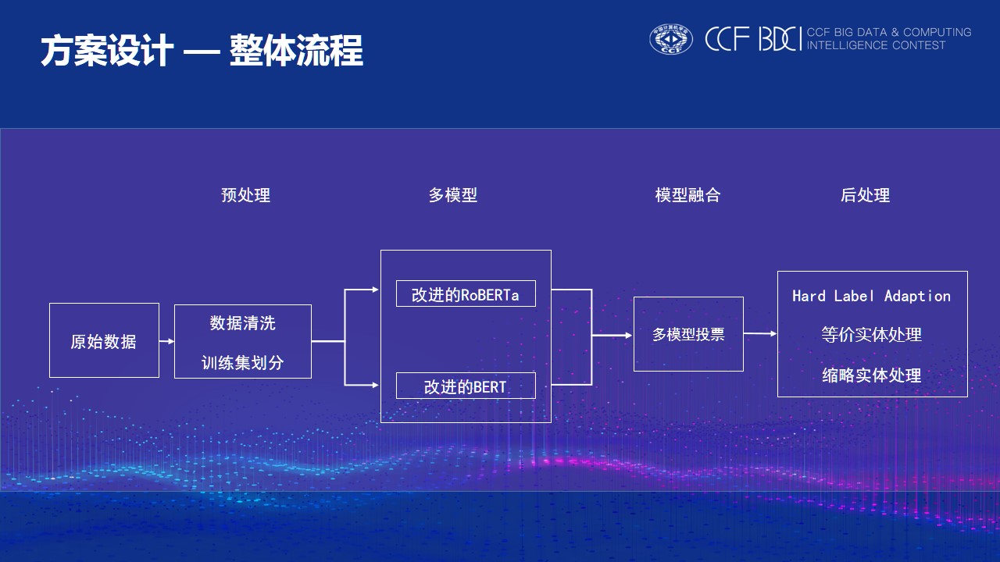


数据集构造部分，我们按照如下形式构造，即看作实体级情感分类任务

```
<ID> <TEXT> <ENTITY> <LABEL>
```

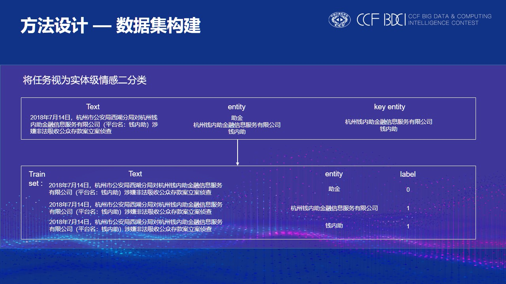


数据预处理部分我们采用如下操作：

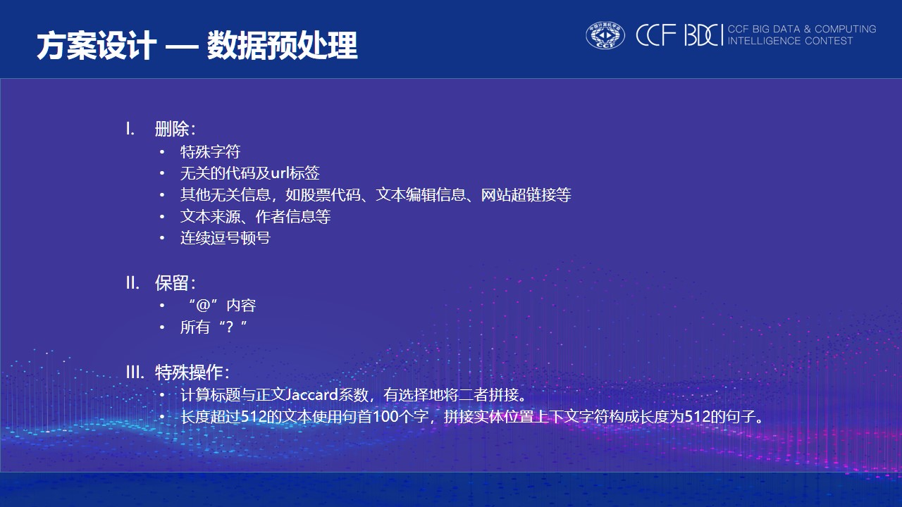


为了更好学习到语料的信息，我们对语言模型在本数据集上又进行一次预训练

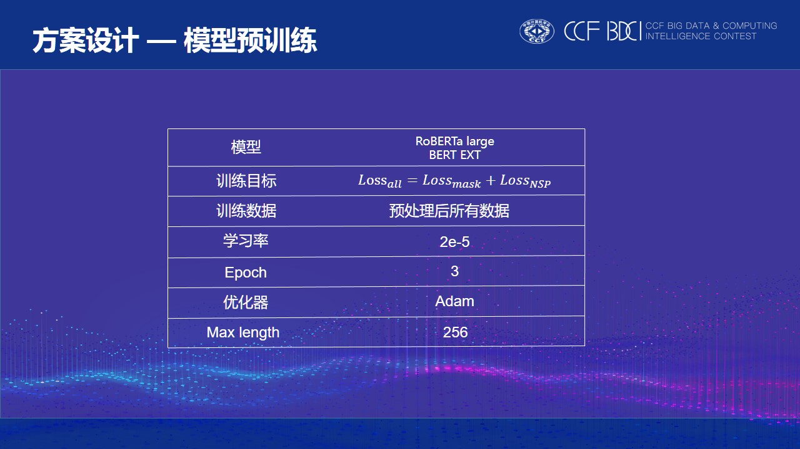

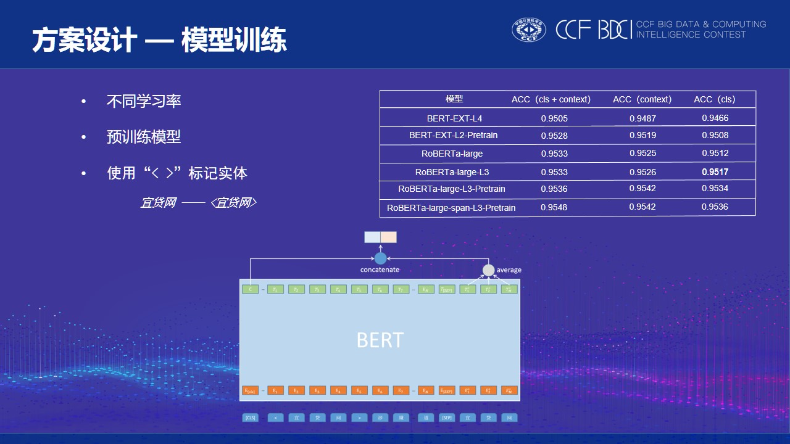


之后我们采用投票的形式进行多个模型融合(在我们这里stacking效果不好)

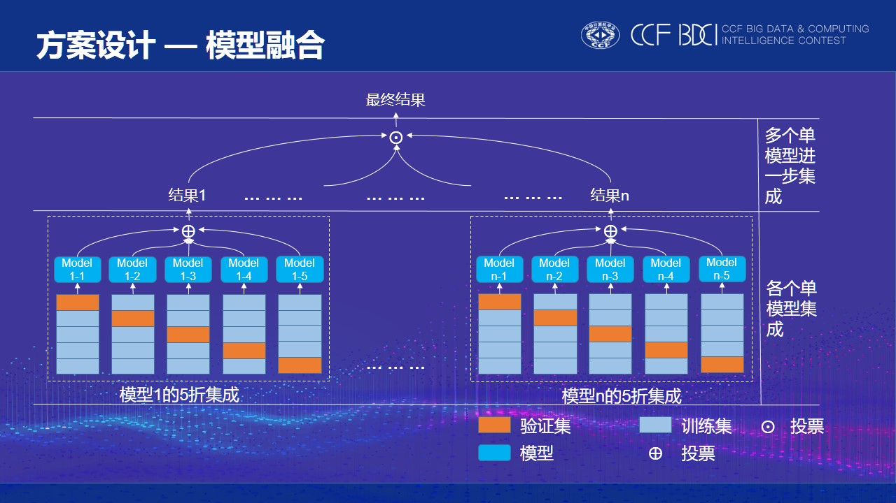


我们还采用了类似KNN以及FAQ的思想设计了Hard Label Adaption操作：

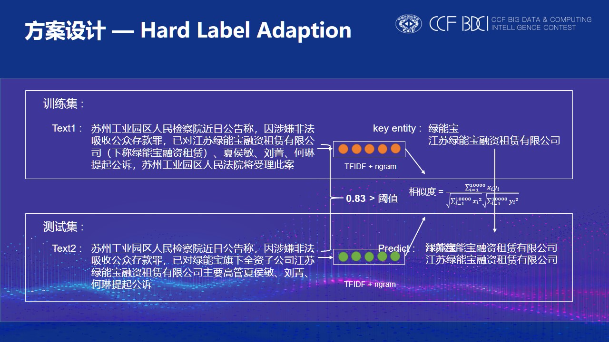


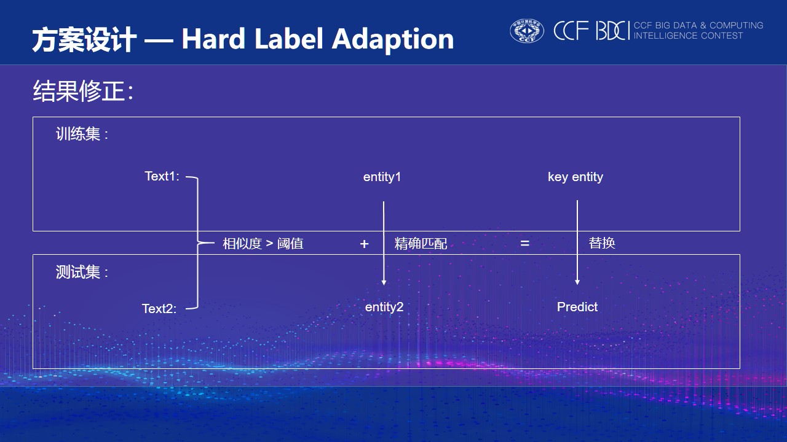


之后我们还对等价实体（或者说是并列实体），即逗号顿号分号分隔的实体进行处理

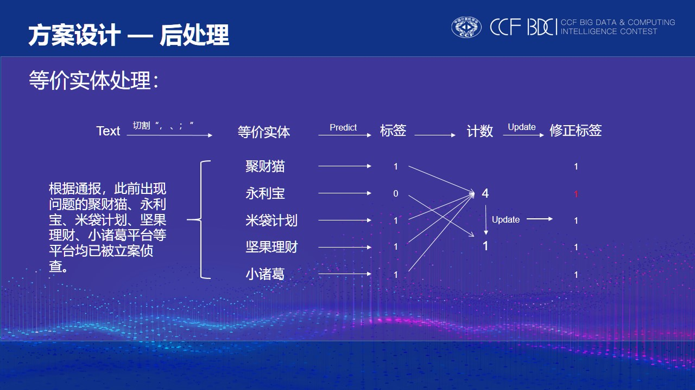


方案探索部分所尝试的策略与模型

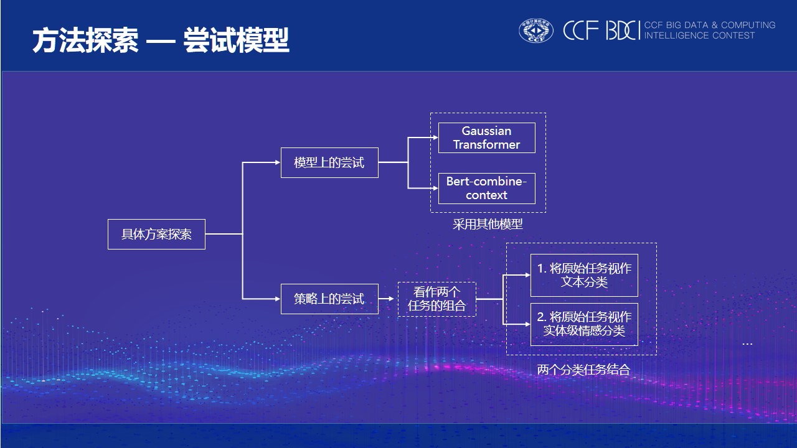

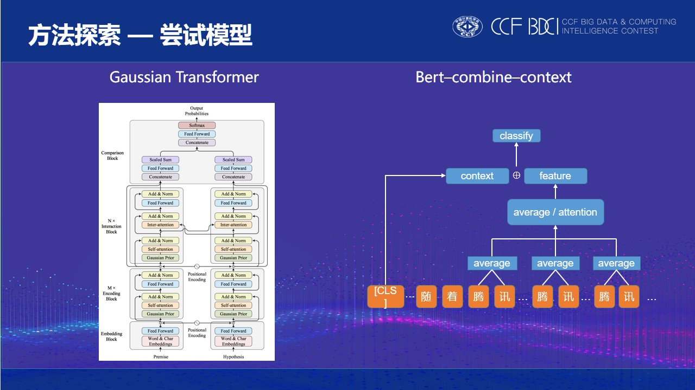

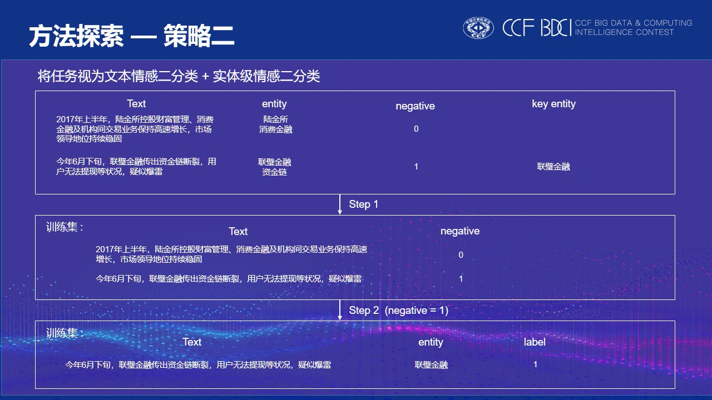

最终结果，线上第一：

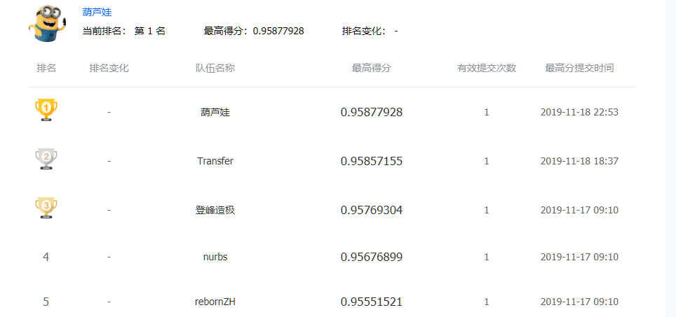


### 如何运行代码

source的结构如下：

```large_cls、large_nocls、small_cls、small_nocls``` 是四种模型的源代码文件。其中，```large_cls``` 和```small_cls``` 是一组，```large_nocls``` 和 ```small_nocls``` 是一组。


1. 首先将bert_ext 和 roberta_large 在金融负面信息数据集上finetuning：

   运行：pytorch-transformers（hugingface开源代码中pretrain文件）

   ```shell
   bash run_lm_small.sh
   bash run_lm_large.sh
   ```

   注意这个是huggingface提供的原版finetuning文件，它会每30个step保存一次模型，这会存下很多无用的中间模型，为了避免磁盘空间不足，请在运行过程中实时将这些中间checkpoint删除，我们只需要最终保存的checkpoint就行.

2. 模型训练，运行：

   ```shell
   bash /small_cls/test_all_bert_ext_l2_pretrain.sh
   bash /small_cls/ test_all_ext_lr4.sh
   bash /small_nocls/test_all_bert_ext_l2_pretrain.sh
   bash /small_nocls/test_all_ext_lr4.sh
   bash /large_cls/test_all_large.sh
   bash /large_cls/test_all_large_l3.sh
   bash /large_cls/test_all_large_l3_pretrain.sh
   bash /large_cls/test_all_large_span.sh
   
   bash /large_nocls/test_all_large.sh
   bash /large_nocls/test_all_large_l3.sh
   bash /large_nocls/test_all_large_l3_pretrain.sh
   bash /large_nocls/test_all_large_span_lr3.sh
   
   ```

   

3. 按照run.sh 文件中顺序运行文件（修改对应文件夹路径）

   - preprocess.py 对原始文件进行预处理，生成五折数据（为了避免在随机划分时的顺序不同，我们使用了线下训练时的五折数据的顺序）

   - get_saved_6_model_result.py 获得带cls模型的投票结果

   - get_saved_nocls_result.py 获得不带cls模型的结果

   - add_drop_entity.py: 处理未在文本中出现的实体，利用训练集的先验知识构建实体白名单和黑名单，修正模型预测结果：

     白名单：训练集中不在文本内出现的实体但最终出现在key_entity中。

     黑名单：训练集中不在文本内出现的实体但最终不出现在key_entity中。

   - connector.py: 修正文本中以顿号、逗号、空格作为分割的连续出现的实体，其预测结果应该一致。

   - cos_similar.py: 通过训练集和测试集的tfidf值计算测试集中每条数据和训练集的相似度，用于后续one to one label adaption操作。（这个文件会运行比较久，生成的结果我们已经上传，可以重新生成替换）

   - replace.py: one to one label adaption操作，类似于faq。即将训练集的文本内容和待预测实体作为question1，key_entity作为answer。测试集每条数据的文本和待预测实体作为question2。若question2和question1的相似度达到阈值，则返回question1对应的answer修正模型结果。也可从KNN的角度理解，在KNN基础上增加了阈值设置。

   - all_model_merge.py: 利用6个不加cls的bert模型结果修正当前结果。若该6个模型中绝大多数预测结果一致且和当前结果冲突，对当前结果进行修正。

   - post_process.py: 根据训练集数据分布考虑一些special pattern，如“????红岭创投”和“红岭创投”。
